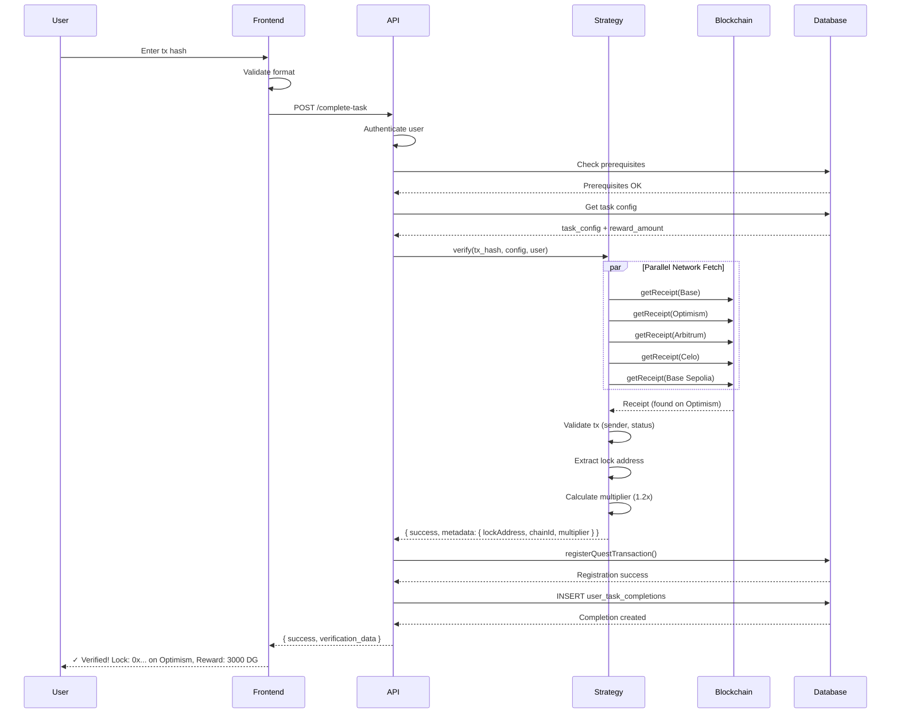

# Locksmith Quest: Multi-Network Lock Deployment Feature
## Product Requirements Document (PRD)

**Version:** 1.0
**Last Updated:** 2026-01-14
**Status:** Planning
**Owner:** Engineering Team
**Stakeholders:** Product, Community, Operations

---

## Table of Contents

1. [Executive Summary](#executive-summary)
2. [Background and Motivation](#background-and-motivation)
3. [Problem Statement](#problem-statement)
4. [Goals and Non-Goals](#goals-and-non-goals)
5. [User Personas and Stories](#user-personas-and-stories)
6. [Product Requirements](#product-requirements)
7. [Technical Architecture](#technical-architecture)
8. [Database Schema](#database-schema)
9. [API Specifications](#api-specifications)
10. [Frontend Specifications](#frontend-specifications)
11. [Security Considerations](#security-considerations)
12. [Testing Strategy](#testing-strategy)
13. [Deployment Plan](#deployment-plan)
14. [Success Metrics and KPIs](#success-metrics-and-kpis)
15. [Risk Mitigation](#risk-mitigation)
16. [Future Enhancements](#future-enhancements)
17. [Appendices](#appendices)

---

## Executive Summary

The **Locksmith Quest** introduces a new quest type that enables P2E INFERNO learners to deploy their first Unlock Protocol lock NFT contract across multiple EVM-compatible networks. This feature provides automatic verification of lock deployments, eliminating manual admin review, and implements network-based reward multipliers to incentivize deployment on specific chains.

### Key Features
- **Multi-network support:** Base, Optimism, Arbitrum, Celo, Base Sepolia
- **Automatic verification:** Zero manual intervention required
- **Dynamic reward allocation:** Network-specific multipliers (0.4x - 1.2x)
- **Replay attack prevention:** Transaction hash uniqueness enforcement
- **Configurable quest variants:** Admins can create different versions for various cohorts

### Business Value
- **Reduced operational overhead:** Eliminates manual verification of 100+ submissions per cohort
- **Improved user experience:** Instant feedback vs. 24-48 hour wait times
- **Educational impact:** Hands-on blockchain deployment experience
- **Network adoption:** Incentivizes deployment on partner chains (Optimism, Arbitrum, Celo)

### Timeline
- **Development:** 2-3 sprints
- **Testing:** 1 sprint
- **Rollout:** Phased (testnet → single mainnet → all networks)

---

## Background and Motivation

### Current State

P2E INFERNO's **"The Art of Self Custody"** bootcamp includes a milestone task titled **"Deploy your first lock"** where learners deploy an Unlock Protocol lock contract to demonstrate mastery of smart contract deployment. Currently:

1. Users deploy locks on any supported network
2. Users submit the transaction hash via a generic URL/text submission form
3. Admins manually verify each submission by:
   - Opening the transaction in a block explorer
   - Confirming it's a valid lock deployment
   - Checking the transaction succeeded
   - Verifying the user wallet matches
   - Approving the submission (3-5 minutes per submission)

### Pain Points

**For Learners:**
- 24-48 hour wait for admin approval
- No immediate feedback on deployment success
- Confusion about which networks are acceptable
- Risk of submitting incorrect transaction hashes

**For Admins:**
- Manual verification of 100+ submissions per cohort
- Repetitive, error-prone process
- Difficulty tracking which networks users deploy on
- No data on network preferences

**For Product:**
- Cannot incentivize specific network adoption
- Limited ability to create network-specific quests
- No analytics on deployment patterns

### Opportunity

Implementing automatic verification enables:
1. **Instant feedback loop** for learners
2. **80% reduction** in admin verification workload
3. **Data-driven insights** into network preferences
4. **Network-specific incentives** to drive ecosystem adoption
5. **Scalable quest architecture** for future blockchain verification tasks

---

## Problem Statement

**How might we automatically verify lock deployments across multiple blockchain networks while providing flexible reward structures that incentivize strategic network adoption?**

### Core Challenges

1. **Multi-network transaction verification** - Different RPC endpoints, availability, latency
2. **Event parsing across chains** - NewLock event structure must be consistent
3. **Replay attack prevention** - Same transaction hash cannot be used twice
4. **Reward fairness** - Multipliers set at verification time, not claim time
5. **User experience** - Clear error messages for all failure scenarios
6. **Admin flexibility** - Easy configuration without code changes

---

## Goals and Non-Goals

### Goals

✅ **Phase 1 (MVP):**
- Support 5 networks: Base, Optimism, Arbitrum, Celo, Base Sepolia
- Automatic verification in < 10 seconds
- Admin-configurable network selection (1-6 networks)
- Admin-configurable reward multipliers per network
- Transaction replay prevention with 100% accuracy
- User-friendly error messages for all failure scenarios
- Maintain existing quest system architecture (DRY principle)

✅ **Phase 2 (Post-MVP):**
- Lock parameter validation (free vs. paid, ERC20 vs. native)
- Timestamp validation (deployment after quest start)
- Block explorer link generation in success state
- Admin dashboard for deployment analytics

### Non-Goals

❌ **Explicitly out of scope:**
- Lock activity tracking (key sales, revenue) - separate feature
- Cross-quest lock prerequisites - future enhancement
- Multi-step lock deployment quests - separate PRD
- Support for non-EVM chains (Solana, Cosmos, etc.)
- Lock metadata validation (name, symbol, description)
- Automated lock configuration after deployment
- Integration with Unlock Protocol's hosted deployment UI

---

## User Personas and Stories

### Persona 1: Quest Participant (Primary)

**Demographics:**
- Age: 18-35
- Experience: Beginner to intermediate blockchain user
- Goal: Learn Web3 development, earn credentials

**User Story:**
> "As a quest participant, I want to deploy my first Unlock Protocol lock and receive immediate verification so that I can progress through the bootcamp without waiting for admin approval."

**Acceptance Criteria:**
- Can submit transaction hash from any supported network
- Receives verification result within 10 seconds
- Sees clear error message if deployment invalid
- Understands which networks are accepted before deploying
- Knows the reward amount for each network

### Persona 2: Quest Admin (Secondary)

**Demographics:**
- Role: Operations, Community Manager
- Experience: Non-technical to technical
- Goal: Reduce manual workload, create engaging quests

**User Story:**
> "As a quest admin, I want to configure which networks are eligible and their reward multipliers so that I can create different quest variants for different cohorts without developer assistance."

**Acceptance Criteria:**
- Can select 1-6 networks from supported list
- Can set reward multiplier per network (0.1x - 2.0x)
- Can enable/disable networks without code deployment
- Can view deployment analytics by network
- Can override verification if needed (manual approval flow)

### Persona 3: Learner Support Staff (Tertiary)

**Demographics:**
- Role: Community moderator, Support agent
- Experience: Non-technical
- Goal: Help learners troubleshoot issues

**User Story:**
> "As a support agent, I want to understand why a learner's deployment was rejected so that I can help them fix the issue and resubmit successfully."

**Acceptance Criteria:**
- Error messages are user-friendly and actionable
- Can view verification history and failure reasons
- Can reference troubleshooting guide for each error code
- Can escalate to admins if verification appears incorrect

---

## Product Requirements

### Functional Requirements

#### FR-1: Multi-Network Transaction Verification
**Priority:** P0 (Must Have)

**Description:** System must verify lock deployment transactions across 5 supported networks automatically.

**Details:**
- Supported networks: Base (8453), Base Sepolia (84532), Optimism (10), Arbitrum (42161), Celo (42220)
- Parallel RPC calls to all enabled networks for optimal latency
- Fallback to sequential if parallel fails
- RPC timeout: 10 seconds per network
- Retry logic: 1 retry with 250ms delay

**Validation:**
- Transaction hash format: `^0x[a-fA-F0-9]{64}$`
- Transaction status: `success` (not `reverted`)
- Transaction sender: matches user's connected wallet
- Transaction contains `NewLock` event from Unlock Protocol factory

#### FR-2: NewLock Event Extraction
**Priority:** P0 (Must Have)

**Description:** Extract and validate lock address from transaction receipt logs.

**Details:**
- Event signature: `0x01017ed19df0c7f8acc436147b234b09664a9fb4797b4fa3fb9e599c2eb67be7` (NewLock)
- Parse event topics to extract `newLockAddress`
- Fallback logic if event signature parsing fails
- Validate extracted address format: `^0x[a-fA-F0-9]{40}$`

**Success Criteria:**
- 100% success rate on valid Unlock Protocol deployments
- 0% false positives on non-Unlock deployments

#### FR-3: Replay Attack Prevention
**Priority:** P0 (Must Have)

**Description:** Prevent same transaction hash from being used multiple times across all quests.

**Details:**
- Atomic database insert using `register_quest_transaction()` function
- UNIQUE constraint on `transaction_hash` column
- Returns error code `TX_ALREADY_USED` on duplicate
- Stores: tx_hash, chain_id, user_id, task_id, block_number, lock_address

**Security:**
- Database-level constraint (cannot be bypassed)
- No race conditions (atomic operation)
- Audit trail of all verified transactions

#### FR-4: Dynamic Reward Multipliers
**Priority:** P0 (Must Have)

**Description:** Apply network-specific reward multipliers configured in quest task_config.

**Details:**
- Base reward set in `quest_tasks.reward_amount`
- Network multiplier stored in `task_config.allowed_networks[].reward_ratio`
- Final reward = `floor(base_reward × multiplier)`
- Multiplier frozen at verification time (stored in `verification_data`)
- Range: 0.1x - 2.0x (configurable, typical 0.4x - 1.2x)

**Example:**
```
Base reward: 2500 DG
Network: Optimism (multiplier 1.2)
Final reward: 2500 × 1.2 = 3000 DG
```

#### FR-5: Admin Configuration UI
**Priority:** P1 (Should Have)

**Description:** Admin interface for configuring allowed networks and reward ratios.

**Details:**
- Multi-select dropdown for networks (min 1, max 6)
- Reward ratio input per network (0.1 - 2.0)
- Enable/disable toggle per network
- Preview of final rewards based on base amount
- Validation: at least 1 network must be enabled
- Save to `quest_tasks.task_config` JSONB column

#### FR-6: Timestamp Validation (Optional)
**Priority:** P2 (Nice to Have)

**Description:** Verify deployment occurred after quest start date.

**Details:**
- Optional `min_timestamp` in task_config
- Fetch block timestamp from RPC if configured
- Reject if `block.timestamp < min_timestamp`
- Error code: `TX_TOO_OLD`
- Use case: Prevent users from submitting old deployments

#### FR-7: User Submission Interface
**Priority:** P0 (Must Have)

**Description:** Dedicated form component for transaction hash submission.

**Details:**
- Input field with pattern validation: `^0x[a-fA-F0-9]{64}$`
- Display allowed networks with icons
- Show reward amount per network
- Real-time format validation
- Loading state during verification (spinner + "Verifying on X networks...")
- Success state: Lock address, network, reward amount, block explorer link
- Error state: User-friendly message with troubleshooting tips

### Non-Functional Requirements

#### NFR-1: Performance
- **Verification latency:** < 10 seconds (p95)
- **RPC timeout:** 10 seconds per network
- **Parallel network fetch:** All enabled networks queried simultaneously
- **Database query time:** < 100ms for transaction registration

#### NFR-2: Reliability
- **Uptime:** 99.9% (excluding RPC provider outages)
- **False positive rate:** 0% (no non-deployments verified)
- **False negative rate:** < 0.1% (valid deployments may fail due to RPC issues, allow retry)
- **Replay prevention:** 100% (database constraint)

#### NFR-3: Scalability
- **Concurrent verifications:** Support 100+ simultaneous submissions
- **Quest volume:** Support 1000+ quests with deploy_lock tasks
- **Transaction registry:** Handle 1M+ verified transactions

#### NFR-4: Maintainability
- **Code reuse:** Leverage existing blockchain utilities (95%+ reuse)
- **Configuration:** No code changes for network/reward adjustments
- **Extensibility:** New networks added via configuration
- **Logging:** Comprehensive logging for debugging (logger module)

#### NFR-5: Usability
- **Error messages:** User-friendly, actionable (not technical RPC errors)
- **Submission time:** Form completion in < 30 seconds
- **Help documentation:** Troubleshooting guide for each error code
- **Accessibility:** WCAG 2.1 AA compliant form inputs

---

## Technical Architecture

### System Architecture Diagram

```
┌─────────────────────────────────────────────────────────────────┐
│                         Frontend (React)                         │
│  ┌──────────────────────────────────────────────────────────┐  │
│  │  DeployLockTaskForm.tsx                                   │  │
│  │  - Transaction hash input                                 │  │
│  │  - Network display                                        │  │
│  │  - Reward preview                                         │  │
│  └──────────────────────────────────────────────────────────┘  │
└────────────────────────┬────────────────────────────────────────┘
                         │ POST /api/quests/complete-task
                         │ { questId, taskId, verificationData: { transactionHash } }
                         ▼
┌─────────────────────────────────────────────────────────────────┐
│                    API Layer (Next.js Pages)                     │
│  ┌──────────────────────────────────────────────────────────┐  │
│  │  /api/quests/complete-task.ts                            │  │
│  │  1. Authenticate user (Privy)                            │  │
│  │  2. Check prerequisites                                  │  │
│  │  3. Get verification strategy                            │  │
│  │  4. Call strategy.verify()                               │  │
│  │  5. Register transaction (replay prevention)             │  │
│  │  6. Store completion + verification_data                 │  │
│  └──────────────────────────────────────────────────────────┘  │
└────────────────────────┬────────────────────────────────────────┘
                         │ Strategy Pattern
                         ▼
┌─────────────────────────────────────────────────────────────────┐
│               Verification Layer (Strategy Pattern)              │
│  ┌──────────────────────────────────────────────────────────┐  │
│  │  DeployLockVerificationStrategy                           │  │
│  │  - Validate tx hash format                               │  │
│  │  - Parse task_config                                     │  │
│  │  - Multi-network transaction fetch (parallel)            │  │
│  │  - Validate transaction (status, sender, timestamp)      │  │
│  │  - Extract lock address (NewLock event)                  │  │
│  │  - Calculate reward multiplier                           │  │
│  │  - Return { success, metadata }                          │  │
│  └──────────────────────────────────────────────────────────┘  │
└────────────┬───────────────────────────────┬────────────────────┘
             │                               │
             ▼                               ▼
┌────────────────────────────┐  ┌───────────────────────────────┐
│   Blockchain Layer (Viem)  │  │   Database Layer (Supabase)   │
│  - createPublicClientFor   │  │  - quest_tasks (task_config)  │
│    Chain(chain)            │  │  - user_task_completions      │
│  - getTransactionReceipt() │  │  - quest_verified_txs         │
│  - extractLockAddress()    │  │  - register_quest_transaction │
│                            │  │    () PL/pgSQL function       │
└────────────────────────────┘  └───────────────────────────────┘
             │
             ▼
┌─────────────────────────────────────────────────────────────────┐
│                   RPC Providers (Multi-Network)                  │
│  - Base Mainnet (Alchemy/Infura/Public)                          │
│  - Base Sepolia (Alchemy/Infura/Public)                          │
│  - Optimism (Alchemy/Public)                                     │
│  - Arbitrum (Alchemy/Public)                                     │
│  - Celo (Public)                                                 │
└─────────────────────────────────────────────────────────────────┘
```

### Component Responsibilities

#### 1. Frontend Layer
**File:** `components/quests/DeployLockTaskForm.tsx`

**Responsibilities:**
- Transaction hash input with client-side validation
- Display allowed networks from task_config
- Calculate and display reward preview per network
- Submit to complete-task API
- Display verification status (loading/success/error)
- Render user-friendly error messages

#### 2. API Layer
**Files:**
- `pages/api/quests/complete-task.ts`
- `pages/api/quests/claim-task-reward.ts`

**Responsibilities:**
- User authentication and authorization
- Prerequisite checking
- Strategy pattern orchestration
- Transaction replay prevention
- Completion record persistence
- Reward calculation and distribution

#### 3. Verification Strategy Layer
**Files:**
- `lib/quests/verification/deploy-lock-verification.ts`
- `lib/quests/verification/deploy-lock-utils.ts`
- `lib/quests/verification/registry.ts`

**Responsibilities:**
- Multi-network transaction fetching
- NewLock event parsing
- Transaction validation (sender, status, timestamp)
- Reward multiplier calculation
- Error code generation
- Metadata construction

#### 4. Blockchain Utilities Layer
**Files:**
- `lib/blockchain/config/clients/public-client.ts` (existing)
- `lib/blockchain/shared/transaction-utils.ts` (existing)
- `lib/blockchain/config/core/chain-map.ts` (existing)

**Responsibilities:**
- RPC client creation with fallback
- Transaction receipt fetching
- Lock address extraction from events
- Chain ID resolution

#### 5. Database Layer
**Files:**
- `supabase/migrations/130_add_deploy_lock_task_type.sql`
- `lib/quests/verification/replay-prevention.ts` (existing)

**Responsibilities:**
- Schema validation (task_type enum)
- Transaction registration (atomic insert)
- Completion record storage
- RLS policy enforcement

### Data Flow Sequence



### Technology Stack

| Layer | Technology | Version | Purpose |
|-------|-----------|---------|---------|
| Frontend | React | 18.x | UI components |
| Frontend | TypeScript | 5.x | Type safety |
| API | Next.js Pages | 14.x | API routes |
| Blockchain | Viem | 2.x | Ethereum interactions |
| Database | PostgreSQL | 15.x | Data persistence |
| Database | Supabase | Latest | DB client + RLS |
| Auth | Privy | Latest | User authentication |
| Logging | Winston (custom) | 3.x | Structured logging |

---

## Database Schema

### Modified Tables

#### `quest_tasks` (Constraint Update)
```sql
ALTER TABLE public.quest_tasks DROP CONSTRAINT IF EXISTS quest_tasks_task_type_check;
ALTER TABLE public.quest_tasks ADD CONSTRAINT quest_tasks_task_type_check
CHECK (task_type IN (
  'link_email', 'link_wallet', 'link_farcaster', 'sign_tos',
  'submit_url', 'submit_text', 'submit_proof', 'complete_external', 'custom',
  'vendor_buy', 'vendor_sell', 'vendor_light_up', 'vendor_level_up',
  'deploy_lock'  -- NEW
));
```

**Migration:** `supabase/migrations/130_add_deploy_lock_task_type.sql`

### Existing Tables (No Schema Changes)

#### `quest_tasks` (JSONB Configuration)
**Column:** `task_config` (JSONB)

**Schema for deploy_lock:**
```json
{
  "allowed_networks": [
    {
      "chain_id": 8453,
      "reward_ratio": 1.0,
      "enabled": true
    },
    {
      "chain_id": 10,
      "reward_ratio": 1.2,
      "enabled": true
    }
  ],
  "min_timestamp": 1704067200
}
```

**Validation:**
- `allowed_networks` MUST be array with length >= 1
- Each network MUST have: `chain_id` (number), `reward_ratio` (number), `enabled` (boolean)
- `chain_id` MUST be in: [8453, 84532, 10, 42161, 42220]
- `reward_ratio` MUST be > 0 and <= 2.0
- At least 1 network MUST have `enabled: true`
- `min_timestamp` OPTIONAL, integer (Unix timestamp)

#### `user_task_completions` (Metadata Storage)
**Column:** `verification_data` (JSONB)

**Schema for deploy_lock:**
```json
{
  "transactionHash": "0x123...",
  "chainId": 10,
  "lockAddress": "0xabc...",
  "blockNumber": "12345678",
  "rewardMultiplier": 1.2,
  "verifiedAt": "2026-01-14T10:30:00.000Z",
  "verificationMethod": "blockchain"
}
```

#### `quest_verified_transactions` (Replay Prevention)
**Existing Columns:**
- `id` (UUID, PK)
- `transaction_hash` (TEXT, UNIQUE) ← Critical for replay prevention
- `chain_id` (INTEGER)
- `user_id` (UUID)
- `task_id` (UUID)
- `task_type` (TEXT)
- `verified_amount` (TEXT, nullable) ← NULL for deploy_lock
- `event_name` (TEXT) ← "NewLock" for deploy_lock
- `block_number` (TEXT, nullable)
- `log_index` (INTEGER, nullable)
- `created_at` (TIMESTAMP)

**New Data for deploy_lock:**
```sql
INSERT INTO quest_verified_transactions (
  transaction_hash,
  chain_id,
  user_id,
  task_id,
  task_type,
  verified_amount,
  event_name,
  block_number
) VALUES (
  '0x123...',
  10,
  'user-uuid',
  'task-uuid',
  'deploy_lock',
  NULL,  -- No amount for deployments
  'NewLock',
  '12345678'
);
```

### Database Functions

#### `register_quest_transaction()` (Existing)
**File:** `supabase/migrations/116_add_quest_verified_transactions.sql`

**Signature:**
```sql
FUNCTION register_quest_transaction(
  p_tx_hash TEXT,
  p_chain_id INTEGER,
  p_user_id UUID,
  p_task_id UUID,
  p_task_type TEXT,
  p_verified_amount TEXT DEFAULT NULL,
  p_event_name TEXT DEFAULT NULL,
  p_block_number TEXT DEFAULT NULL,
  p_log_index INTEGER DEFAULT NULL
) RETURNS JSONB
```

**Behavior:**
- Attempts atomic INSERT
- Returns `{ "success": true }` if inserted
- Returns `{ "success": false, "error": "duplicate" }` if UNIQUE constraint violated
- Prevents race conditions

**Usage for deploy_lock:**
```typescript
const result = await registerQuestTransaction(supabase, {
  txHash: '0x123...',
  userId: 'user-uuid',
  taskId: 'task-uuid',
  taskType: 'deploy_lock',
  metadata: {
    amount: null,
    eventName: 'NewLock',
    blockNumber: '12345678',
    logIndex: null,
  },
});
```

---

## API Specifications

### Endpoint: Complete Deploy Lock Task

**Route:** `POST /api/quests/complete-task`
**File:** `pages/api/quests/complete-task.ts`

#### Request

**Headers:**
```
Authorization: Bearer <privy_jwt_token>
Content-Type: application/json
```

**Body:**
```json
{
  "questId": "uuid",
  "taskId": "uuid",
  "verificationData": {
    "transactionHash": "0x1234567890abcdef..."
  }
}
```

**Validation:**
- `questId` - Required, UUID format
- `taskId` - Required, UUID format
- `verificationData.transactionHash` - Required, pattern: `^0x[a-fA-F0-9]{64}$`

#### Response (Success)

**Status:** `200 OK`

```json
{
  "success": true,
  "completion": {
    "id": "completion-uuid",
    "task_id": "task-uuid",
    "submission_status": "completed",
    "verification_data": {
      "transactionHash": "0x123...",
      "chainId": 10,
      "lockAddress": "0xabc...",
      "blockNumber": "12345678",
      "rewardMultiplier": 1.2,
      "verifiedAt": "2026-01-14T10:30:00.000Z"
    },
    "completed_at": "2026-01-14T10:30:00.000Z"
  }
}
```

#### Response (Verification Failed)

**Status:** `400 Bad Request`

```json
{
  "error": "Transaction not found on any allowed network",
  "code": "TX_NOT_FOUND_MULTI_NETWORK",
  "allowedNetworks": ["Base Mainnet", "Optimism", "Arbitrum One"]
}
```

#### Error Codes

| Code | HTTP Status | User Message | Troubleshooting |
|------|-------------|--------------|-----------------|
| `TX_HASH_REQUIRED` | 400 | Please enter a transaction hash | Ensure tx hash is provided |
| `INVALID_TX_HASH` | 400 | Invalid transaction hash format. Must be 0x followed by 64 hex characters. | Check for typos, must start with 0x |
| `TX_NOT_FOUND_MULTI_NETWORK` | 400 | Transaction not found on any allowed network. Did you deploy to the correct network? | Verify deployment network, check tx hash |
| `TX_FAILED` | 400 | This transaction failed on-chain. Please submit a successful deployment. | Check transaction status in block explorer |
| `SENDER_MISMATCH` | 400 | This transaction was not sent from your connected wallet. | Ensure wallet matches deployment wallet |
| `TX_TOO_OLD` | 400 | This deployment occurred before the quest started. Please deploy a new lock. | Deploy new lock after quest start date |
| `LOCK_ADDRESS_NOT_FOUND` | 400 | Could not find lock deployment in this transaction. Is this an Unlock Protocol lock deployment? | Verify this is a lock deployment, not another contract |
| `TX_ALREADY_USED` | 400 | This transaction has already been used for a quest task. | Submit a different deployment |
| `INVALID_CONFIG` | 500 | Quest configuration error. Please contact support. | Admin must fix task_config |
| `VERIFICATION_ERROR` | 500 | Verification failed. Please try again or contact support. | Retry, contact support if persists |

### Endpoint: Claim Deploy Lock Reward

**Route:** `POST /api/quests/claim-task-reward`
**File:** `pages/api/quests/claim-task-reward.ts`

#### Request

**Headers:**
```
Authorization: Bearer <privy_jwt_token>
Content-Type: application/json
```

**Body:**
```json
{
  "taskId": "uuid"
}
```

#### Response (Success)

**Status:** `200 OK`

```json
{
  "success": true,
  "reward": {
    "amount": 3000,
    "baseAmount": 2500,
    "multiplier": 1.2,
    "network": "Optimism"
  },
  "newExperience": 15000
}
```

#### Reward Calculation Logic

```typescript
// Pseudocode
const task = await getTask(taskId);
const completion = await getCompletion(userId, taskId);

const baseReward = task.reward_amount; // e.g., 2500
const multiplier = completion.verification_data?.rewardMultiplier || 1.0; // e.g., 1.2
const actualReward = Math.floor(baseReward * multiplier); // floor(2500 * 1.2) = 3000

await awardExperience(userId, actualReward);
```

**Key Points:**
- Multiplier frozen at verification time (stored in `verification_data`)
- Quest config changes after verification do NOT affect reward
- Ensures fairness and prevents retroactive changes

---

## Frontend Specifications

### Component: DeployLockTaskForm

**File:** `components/quests/DeployLockTaskForm.tsx`

#### Props Interface

```typescript
interface DeployLockTaskFormProps {
  taskId: string;
  questId: string;
  taskConfig: {
    allowed_networks: {
      chain_id: number;
      reward_ratio: number;
      enabled: boolean;
    }[];
    min_timestamp?: number;
  };
  baseReward: number;
  onSuccess?: (completion: TaskCompletion) => void;
}
```

#### Component Structure

```tsx
<form onSubmit={handleSubmit}>
  {/* Network Information Section */}
  <div className="network-info">
    <h3>Accepted Networks</h3>
    <ul>
      {allowedNetworks.map(net => (
        <li key={net.chain_id}>
          <NetworkIcon chainId={net.chain_id} />
          <span>{getNetworkDisplayName(net.chain_id)}</span>
          <span className="reward">
            {calculateRewardAmount(baseReward, net.chain_id, taskConfig)} DG
          </span>
        </li>
      ))}
    </ul>
  </div>

  {/* Transaction Hash Input */}
  <div className="input-group">
    <label htmlFor="tx-hash">Deployment Transaction Hash</label>
    <input
      id="tx-hash"
      type="text"
      value={txHash}
      onChange={(e) => setTxHash(e.target.value)}
      placeholder="0x..."
      pattern="^0x[a-fA-F0-9]{64}$"
      required
      aria-describedby="tx-hash-help"
    />
    <small id="tx-hash-help">
      Paste the transaction hash from your lock deployment
    </small>
  </div>

  {/* Error Display */}
  {error && (
    <div className="alert alert-error" role="alert">
      <strong>{errorCodeToMessage(error.code)}</strong>
      <p>{errorCodeToTroubleshooting(error.code)}</p>
    </div>
  )}

  {/* Success Display */}
  {success && (
    <div className="alert alert-success" role="alert">
      <h4>✓ Lock Deployment Verified!</h4>
      <dl>
        <dt>Network:</dt>
        <dd>{getNetworkDisplayName(verificationData.chainId)}</dd>
        <dt>Lock Address:</dt>
        <dd>
          <code>{verificationData.lockAddress}</code>
          <a href={getBlockExplorerLink(verificationData)} target="_blank">
            View on Explorer →
          </a>
        </dd>
        <dt>Reward:</dt>
        <dd>{finalReward} DG ({multiplier}x multiplier)</dd>
      </dl>
    </div>
  )}

  {/* Submit Button */}
  <button
    type="submit"
    disabled={isSubmitting || !txHash}
    aria-busy={isSubmitting}
  >
    {isSubmitting ? (
      <>
        <Spinner />
        Verifying on {allowedNetworks.length} network(s)...
      </>
    ) : (
      'Submit Deployment'
    )}
  </button>
</form>
```

#### State Management

```typescript
const [txHash, setTxHash] = useState('');
const [isSubmitting, setIsSubmitting] = useState(false);
const [error, setError] = useState<{ code: string; message: string } | null>(null);
const [success, setSuccess] = useState(false);
const [verificationData, setVerificationData] = useState<VerificationMetadata | null>(null);
```

#### Validation Logic

```typescript
// Client-side validation before API call
const validateTxHash = (hash: string): boolean => {
  return /^0x[a-fA-F0-9]{64}$/.test(hash);
};

const handleSubmit = async (e: React.FormEvent) => {
  e.preventDefault();

  if (!validateTxHash(txHash)) {
    setError({
      code: 'INVALID_TX_HASH',
      message: 'Invalid transaction hash format'
    });
    return;
  }

  setIsSubmitting(true);
  setError(null);

  try {
    const response = await fetch('/api/quests/complete-task', {
      method: 'POST',
      headers: { 'Content-Type': 'application/json' },
      body: JSON.stringify({
        questId,
        taskId,
        verificationData: { transactionHash: txHash }
      })
    });

    const data = await response.json();

    if (!response.ok) {
      setError({ code: data.code, message: data.error });
      return;
    }

    setSuccess(true);
    setVerificationData(data.completion.verification_data);
    onSuccess?.(data.completion);
  } catch (err) {
    setError({
      code: 'NETWORK_ERROR',
      message: 'Failed to submit. Please check your connection and try again.'
    });
  } finally {
    setIsSubmitting(false);
  }
};
```

#### Accessibility Features

- **ARIA labels:** All form inputs have proper labels
- **Error announcements:** Error messages use `role="alert"` for screen readers
- **Keyboard navigation:** Full keyboard support, no mouse required
- **Loading states:** `aria-busy` attribute during submission
- **Focus management:** Auto-focus on error message when validation fails

#### Mobile Responsiveness

- **Touch targets:** Minimum 44x44px for all interactive elements
- **Input sizing:** Large enough for mobile keyboards
- **Network list:** Scrollable on small screens
- **Copy/paste:** Easy transaction hash pasting on mobile

---

## Security Considerations

### Threat Model

#### Threat 1: Transaction Replay Attacks
**Description:** Attacker submits same transaction hash multiple times to claim rewards repeatedly.

**Mitigation:**
- Database UNIQUE constraint on `transaction_hash` column
- Atomic `register_quest_transaction()` function
- Returns `TX_ALREADY_USED` error on duplicate
- No race conditions (database-level enforcement)

**Risk Level:** ✅ Mitigated

#### Threat 2: Wallet Address Spoofing
**Description:** Attacker submits transaction from different wallet to claim reward.

**Mitigation:**
- Verify `receipt.from` matches `userWallet` from Privy
- User wallet retrieved from Privy's server-side SDK (trusted source)
- Returns `SENDER_MISMATCH` error on mismatch

**Risk Level:** ✅ Mitigated

#### Threat 3: RPC Manipulation
**Description:** Attacker runs malicious RPC node to fake transaction receipts.

**Mitigation:**
- Use trusted RPC providers (Alchemy, Infura, official public endpoints)
- Fallback provider architecture (cannot compromise all providers)
- Cross-verify transaction on block explorers (future enhancement)

**Risk Level:** 🟡 Low (trusted providers only)

#### Threat 4: Smart Contract Vulnerability
**Description:** Attacker deploys malicious contract that emits fake NewLock events.

**Mitigation:**
- NewLock event signature is specific to Unlock Protocol factory
- Extract lock address from event topics (cannot be faked without valid deployment)
- Optionally: Verify lock address implements IPublicLock interface (future enhancement)

**Risk Level:** 🟡 Low (event signature validation)

#### Threat 5: Admin Privilege Abuse
**Description:** Malicious admin configures impossible reward multipliers or disables all networks.

**Mitigation:**
- Reward ratio validation: 0.1 - 2.0 range
- At least 1 network must be enabled (frontend validation)
- Admin actions logged in audit trail
- Admin dashboard requires admin-session authentication

**Risk Level:** 🟡 Low (validation + logging)

#### Threat 6: XSS via Transaction Hash
**Description:** Attacker submits malicious script in transaction hash field.

**Mitigation:**
- Strict regex validation: `^0x[a-fA-F0-9]{64}$`
- React auto-escaping for display
- No `dangerouslySetInnerHTML` usage

**Risk Level:** ✅ Mitigated

### Data Privacy

**User Data Collected:**
- Wallet address (necessary for verification)
- Transaction hash (necessary for verification)
- Chain ID (necessary for network detection)
- Lock address (public on-chain data)
- Verification timestamp (audit trail)

**Data Retention:**
- Verified transactions: Permanent (audit trail)
- Task completions: Permanent (user progress)
- RPC logs: 30 days (debugging)

**Data Sharing:**
- RPC providers see: Transaction hash, user IP (via RPC call)
- Block explorers: None (links generated, not API calls)
- Third parties: None

### Authentication & Authorization

**Authentication:**
- Privy JWT token required for all API calls
- Token validated server-side via `getPrivyUser(req)`
- Invalid/expired tokens return 401 Unauthorized

**Authorization:**
- Users can only submit for their own account
- Cannot submit for other users' tasks
- Admin endpoints require admin-session cookie (when enabled)

**Wallet Verification:**
- Primary wallet fetched from Privy linked accounts
- Wallet linkage verified server-side (not client-provided)
- Prevents wallet address spoofing

---

## Testing Strategy

### Unit Tests

**File:** `lib/quests/verification/__tests__/deploy-lock-verification.test.ts`

#### Test Suite 1: Configuration Parsing
```typescript
describe('DeployLockVerificationStrategy - Config Parsing', () => {
  test('parses valid config with multiple networks', async () => {
    const config = {
      allowed_networks: [
        { chain_id: 8453, reward_ratio: 1.0, enabled: true },
        { chain_id: 10, reward_ratio: 1.2, enabled: true }
      ]
    };
    const result = strategy.parseTaskConfig(config);
    expect(result.success).toBe(true);
    expect(result.config.allowed_networks).toHaveLength(2);
  });

  test('rejects config with no enabled networks', async () => {
    const config = {
      allowed_networks: [
        { chain_id: 8453, reward_ratio: 1.0, enabled: false }
      ]
    };
    const result = strategy.parseTaskConfig(config);
    expect(result.success).toBe(false);
    expect(result.error).toContain('No enabled networks');
  });

  test('rejects config with invalid chain ID', async () => {
    const config = {
      allowed_networks: [
        { chain_id: 99999, reward_ratio: 1.0, enabled: true }
      ]
    };
    const result = strategy.parseTaskConfig(config);
    expect(result.success).toBe(false);
    expect(result.error).toContain('Invalid chain ID');
  });

  test('rejects config with negative reward ratio', async () => {
    const config = {
      allowed_networks: [
        { chain_id: 8453, reward_ratio: -0.5, enabled: true }
      ]
    };
    const result = strategy.parseTaskConfig(config);
    expect(result.success).toBe(false);
  });
});
```

#### Test Suite 2: Transaction Verification
```typescript
describe('DeployLockVerificationStrategy - Transaction Verification', () => {
  test('verifies valid deployment on Base Sepolia', async () => {
    const mockReceipt = createMockReceipt({
      status: 'success',
      from: USER_ADDRESS,
      chainId: 84532,
      logs: [createNewLockEvent(LOCK_ADDRESS)]
    });

    mockClient.getTransactionReceipt.mockResolvedValue(mockReceipt);

    const result = await strategy.verify(
      'deploy_lock',
      { transactionHash: TX_HASH },
      USER_ID,
      USER_ADDRESS,
      { taskConfig: BASE_SEPOLIA_CONFIG }
    );

    expect(result.success).toBe(true);
    expect(result.metadata.chainId).toBe(84532);
    expect(result.metadata.lockAddress).toBe(LOCK_ADDRESS);
    expect(result.metadata.rewardMultiplier).toBe(1.0);
  });

  test('rejects transaction from wrong sender', async () => {
    const mockReceipt = createMockReceipt({
      status: 'success',
      from: DIFFERENT_ADDRESS,
      chainId: 84532
    });

    mockClient.getTransactionReceipt.mockResolvedValue(mockReceipt);

    const result = await strategy.verify(
      'deploy_lock',
      { transactionHash: TX_HASH },
      USER_ID,
      USER_ADDRESS,
      { taskConfig: BASE_SEPOLIA_CONFIG }
    );

    expect(result.success).toBe(false);
    expect(result.code).toBe('SENDER_MISMATCH');
  });

  test('rejects failed transaction', async () => {
    const mockReceipt = createMockReceipt({
      status: 'reverted',
      from: USER_ADDRESS,
      chainId: 84532
    });

    mockClient.getTransactionReceipt.mockResolvedValue(mockReceipt);

    const result = await strategy.verify(
      'deploy_lock',
      { transactionHash: TX_HASH },
      USER_ID,
      USER_ADDRESS,
      { taskConfig: BASE_SEPOLIA_CONFIG }
    );

    expect(result.success).toBe(false);
    expect(result.code).toBe('TX_FAILED');
  });

  test('handles transaction not found on any network', async () => {
    mockClient.getTransactionReceipt.mockRejectedValue(
      new Error('Transaction not found')
    );

    const result = await strategy.verify(
      'deploy_lock',
      { transactionHash: TX_HASH },
      USER_ID,
      USER_ADDRESS,
      { taskConfig: MULTI_NETWORK_CONFIG }
    );

    expect(result.success).toBe(false);
    expect(result.code).toBe('TX_NOT_FOUND_MULTI_NETWORK');
  });

  test('applies correct reward multiplier for Optimism', async () => {
    const mockReceipt = createMockReceipt({
      status: 'success',
      from: USER_ADDRESS,
      chainId: 10,
      logs: [createNewLockEvent(LOCK_ADDRESS)]
    });

    mockOptimismClient.getTransactionReceipt.mockResolvedValue(mockReceipt);

    const result = await strategy.verify(
      'deploy_lock',
      { transactionHash: TX_HASH },
      USER_ID,
      USER_ADDRESS,
      { taskConfig: OPTIMISM_CONFIG }
    );

    expect(result.success).toBe(true);
    expect(result.metadata.rewardMultiplier).toBe(1.2);
  });
});
```

#### Test Suite 3: Timestamp Validation
```typescript
describe('DeployLockVerificationStrategy - Timestamp Validation', () => {
  test('accepts deployment after min_timestamp', async () => {
    const mockReceipt = createMockReceipt({
      status: 'success',
      from: USER_ADDRESS,
      blockNumber: 12345n
    });

    const mockBlock = {
      timestamp: 1704070000n // After min_timestamp
    };

    mockClient.getTransactionReceipt.mockResolvedValue(mockReceipt);
    mockClient.getBlock.mockResolvedValue(mockBlock);

    const configWithTimestamp = {
      allowed_networks: [{ chain_id: 84532, reward_ratio: 1.0, enabled: true }],
      min_timestamp: 1704067200
    };

    const result = await strategy.verify(
      'deploy_lock',
      { transactionHash: TX_HASH },
      USER_ID,
      USER_ADDRESS,
      { taskConfig: configWithTimestamp }
    );

    expect(result.success).toBe(true);
  });

  test('rejects deployment before min_timestamp', async () => {
    const mockReceipt = createMockReceipt({
      status: 'success',
      from: USER_ADDRESS,
      blockNumber: 12345n
    });

    const mockBlock = {
      timestamp: 1704060000n // Before min_timestamp
    };

    mockClient.getTransactionReceipt.mockResolvedValue(mockReceipt);
    mockClient.getBlock.mockResolvedValue(mockBlock);

    const configWithTimestamp = {
      allowed_networks: [{ chain_id: 84532, reward_ratio: 1.0, enabled: true }],
      min_timestamp: 1704067200
    };

    const result = await strategy.verify(
      'deploy_lock',
      { transactionHash: TX_HASH },
      USER_ID,
      USER_ADDRESS,
      { taskConfig: configWithTimestamp }
    );

    expect(result.success).toBe(false);
    expect(result.code).toBe('TX_TOO_OLD');
  });
});
```

#### Test Suite 4: Lock Address Extraction
```typescript
describe('DeployLockVerificationStrategy - Lock Address Extraction', () => {
  test('extracts lock address from NewLock event', async () => {
    const mockReceipt = createMockReceipt({
      status: 'success',
      from: USER_ADDRESS,
      logs: [
        {
          topics: [
            '0x01017ed19df0c7f8acc436147b234b09664a9fb4797b4fa3fb9e599c2eb67be7',
            `0x000000000000000000000000${USER_ADDRESS.slice(2)}`,
            `0x000000000000000000000000${LOCK_ADDRESS.slice(2)}`
          ],
          data: '0x'
        }
      ]
    });

    mockClient.getTransactionReceipt.mockResolvedValue(mockReceipt);

    const result = await strategy.verify(
      'deploy_lock',
      { transactionHash: TX_HASH },
      USER_ID,
      USER_ADDRESS,
      { taskConfig: BASE_SEPOLIA_CONFIG }
    );

    expect(result.success).toBe(true);
    expect(result.metadata.lockAddress).toBe(LOCK_ADDRESS);
  });

  test('handles missing NewLock event', async () => {
    const mockReceipt = createMockReceipt({
      status: 'success',
      from: USER_ADDRESS,
      logs: [] // No NewLock event
    });

    mockClient.getTransactionReceipt.mockResolvedValue(mockReceipt);

    const result = await strategy.verify(
      'deploy_lock',
      { transactionHash: TX_HASH },
      USER_ID,
      USER_ADDRESS,
      { taskConfig: BASE_SEPOLIA_CONFIG }
    );

    expect(result.success).toBe(false);
    expect(result.code).toBe('LOCK_ADDRESS_NOT_FOUND');
  });
});
```

**Coverage Target:** 95% line coverage, 90% branch coverage

### Integration Tests

**File:** `__tests__/integration/quests/deploy-lock-quest.test.ts`

#### End-to-End Flow Test
```typescript
describe('Deploy Lock Quest - E2E', () => {
  let testQuest: Quest;
  let testTask: QuestTask;
  let testUser: User;

  beforeAll(async () => {
    // Setup test quest with deploy_lock task
    testQuest = await createTestQuest({
      title: 'Test Deploy Lock Quest',
      is_active: true
    });

    testTask = await createTestQuestTask({
      quest_id: testQuest.id,
      task_type: 'deploy_lock',
      reward_amount: 2500,
      task_config: {
        allowed_networks: [
          { chain_id: 84532, reward_ratio: 1.0, enabled: true }
        ]
      },
      verification_method: 'blockchain'
    });

    testUser = await createTestUser();
  });

  test('complete flow: deploy → verify → claim', async () => {
    // Step 1: Deploy lock on Base Sepolia (actual deployment)
    const deploymentTx = await deployTestLock(testUser.wallet);
    await deploymentTx.wait();

    // Step 2: Submit transaction hash
    const completeResponse = await fetch('/api/quests/complete-task', {
      method: 'POST',
      headers: {
        'Authorization': `Bearer ${testUser.privyToken}`,
        'Content-Type': 'application/json'
      },
      body: JSON.stringify({
        questId: testQuest.id,
        taskId: testTask.id,
        verificationData: {
          transactionHash: deploymentTx.hash
        }
      })
    });

    expect(completeResponse.status).toBe(200);
    const completeData = await completeResponse.json();
    expect(completeData.success).toBe(true);
    expect(completeData.completion.submission_status).toBe('completed');
    expect(completeData.completion.verification_data.lockAddress).toBeDefined();

    // Step 3: Verify transaction registered (replay prevention)
    const { data: verifiedTx } = await supabase
      .from('quest_verified_transactions')
      .select('*')
      .eq('transaction_hash', deploymentTx.hash)
      .single();

    expect(verifiedTx).toBeDefined();
    expect(verifiedTx.task_type).toBe('deploy_lock');
    expect(verifiedTx.event_name).toBe('NewLock');

    // Step 4: Claim reward
    const claimResponse = await fetch('/api/quests/claim-task-reward', {
      method: 'POST',
      headers: {
        'Authorization': `Bearer ${testUser.privyToken}`,
        'Content-Type': 'application/json'
      },
      body: JSON.stringify({
        taskId: testTask.id
      })
    });

    expect(claimResponse.status).toBe(200);
    const claimData = await claimResponse.json();
    expect(claimData.reward.amount).toBe(2500); // 2500 * 1.0 multiplier

    // Step 5: Verify user XP increased
    const { data: updatedUser } = await supabase
      .from('user_profiles')
      .select('experience_points')
      .eq('privy_did', testUser.id)
      .single();

    expect(updatedUser.experience_points).toBeGreaterThanOrEqual(2500);
  });

  test('replay attack prevention', async () => {
    const deploymentTx = await deployTestLock(testUser.wallet);
    await deploymentTx.wait();

    // First submission succeeds
    const firstResponse = await fetch('/api/quests/complete-task', {
      method: 'POST',
      headers: {
        'Authorization': `Bearer ${testUser.privyToken}`,
        'Content-Type': 'application/json'
      },
      body: JSON.stringify({
        questId: testQuest.id,
        taskId: testTask.id,
        verificationData: {
          transactionHash: deploymentTx.hash
        }
      })
    });

    expect(firstResponse.status).toBe(200);

    // Second submission with same tx hash fails
    const secondResponse = await fetch('/api/quests/complete-task', {
      method: 'POST',
      headers: {
        'Authorization': `Bearer ${testUser.privyToken}`,
        'Content-Type': 'application/json'
      },
      body: JSON.stringify({
        questId: testQuest.id,
        taskId: testTask.id,
        verificationData: {
          transactionHash: deploymentTx.hash
        }
      })
    });

    expect(secondResponse.status).toBe(400);
    const errorData = await secondResponse.json();
    expect(errorData.code).toBe('TX_ALREADY_USED');
  });
});
```

### Performance Tests

**File:** `__tests__/performance/deploy-lock-performance.test.ts`

```typescript
describe('Deploy Lock Performance', () => {
  test('verification completes within 10 seconds', async () => {
    const startTime = Date.now();

    const result = await strategy.verify(
      'deploy_lock',
      { transactionHash: REAL_TX_HASH },
      USER_ID,
      USER_ADDRESS,
      { taskConfig: MULTI_NETWORK_CONFIG }
    );

    const duration = Date.now() - startTime;

    expect(duration).toBeLessThan(10000); // 10 seconds
    expect(result.success).toBe(true);
  });

  test('handles 100 concurrent verifications', async () => {
    const promises = Array.from({ length: 100 }, (_, i) =>
      strategy.verify(
        'deploy_lock',
        { transactionHash: generateUniqueTxHash(i) },
        `user-${i}`,
        `0x${i.toString().padStart(40, '0')}`,
        { taskConfig: BASE_SEPOLIA_CONFIG }
      )
    );

    const results = await Promise.allSettled(promises);

    const successCount = results.filter(r => r.status === 'fulfilled').length;
    expect(successCount).toBeGreaterThan(95); // 95%+ success rate
  });
});
```

### Test Data Fixtures

**File:** `__tests__/fixtures/deploy-lock-fixtures.ts`

```typescript
export const MOCK_TX_HASH = '0x1234567890abcdef1234567890abcdef1234567890abcdef1234567890abcdef';
export const MOCK_LOCK_ADDRESS = '0xabcdefabcdefabcdefabcdefabcdefabcdefabcd';
export const MOCK_USER_ADDRESS = '0x1111111111111111111111111111111111111111';

export const NEWLOCK_EVENT_SIGNATURE = '0x01017ed19df0c7f8acc436147b234b09664a9fb4797b4fa3fb9e599c2eb67be7';

export function createMockReceipt(overrides: Partial<Receipt>): Receipt {
  return {
    status: 'success',
    from: MOCK_USER_ADDRESS,
    to: '0xUnlockFactoryAddress',
    transactionHash: MOCK_TX_HASH,
    blockNumber: 12345n,
    logs: [],
    ...overrides
  };
}

export function createNewLockEvent(lockAddress: string) {
  return {
    topics: [
      NEWLOCK_EVENT_SIGNATURE,
      `0x000000000000000000000000${MOCK_USER_ADDRESS.slice(2)}`,
      `0x000000000000000000000000${lockAddress.slice(2)}`
    ],
    data: '0x',
    address: '0xUnlockFactoryAddress'
  };
}

export const BASE_SEPOLIA_CONFIG = {
  allowed_networks: [
    { chain_id: 84532, reward_ratio: 1.0, enabled: true }
  ]
};

export const MULTI_NETWORK_CONFIG = {
  allowed_networks: [
    { chain_id: 8453, reward_ratio: 1.0, enabled: true },
    { chain_id: 10, reward_ratio: 1.2, enabled: true },
    { chain_id: 42161, reward_ratio: 1.0, enabled: true },
    { chain_id: 42220, reward_ratio: 0.8, enabled: true }
  ]
};
```

---

## Deployment Plan

### Phase 1: Development (Sprint 1-2)

**Week 1:**
- [ ] Create database migration
- [ ] Implement verification strategy class
- [ ] Implement configuration utilities
- [ ] Write unit tests (95% coverage target)

**Week 2:**
- [ ] Update API routes (complete-task, claim-reward)
- [ ] Update registry and TypeScript types
- [ ] Create frontend form component
- [ ] Write integration tests

### Phase 2: Testing (Sprint 3)

**Week 3:**
- [ ] Deploy to staging environment
- [ ] Run integration test suite on Base Sepolia testnet
- [ ] Perform manual QA testing
- [ ] Security review and penetration testing
- [ ] Performance testing (load test with 100+ concurrent requests)
- [ ] Accessibility audit (WCAG 2.1 AA)

**Week 4:**
- [ ] Bug fixes and refinements
- [ ] Documentation updates (admin guide, user guide)
- [ ] Troubleshooting guide for support team
- [ ] Create demo video for admins

### Phase 3: Rollout (Phased)

**Phase 3.1: Testnet Validation (Week 5)**
- [ ] Deploy to production with Base Sepolia only
- [ ] Create pilot quest for 10-20 beta users
- [ ] Monitor error rates, verification latency
- [ ] Gather user feedback
- [ ] Iterate on error messages and UX

**Phase 3.2: Single Mainnet (Week 6)**
- [ ] Enable Base Mainnet in addition to Base Sepolia
- [ ] Create quest for next cohort (100+ users)
- [ ] Monitor RPC costs, database performance
- [ ] A/B test reward multipliers (data-driven optimization)

**Phase 3.3: All Networks (Week 7)**
- [ ] Enable all 5 networks (Base, Optimism, Arbitrum, Celo, Base Sepolia)
- [ ] Full production rollout
- [ ] Marketing announcement (blog post, social media)
- [ ] Monitor adoption by network

### Rollback Plan

**Rollback Triggers:**
- False positive rate > 1%
- Verification latency p95 > 30 seconds
- RPC costs exceed budget by 50%
- Critical security vulnerability discovered

**Rollback Procedure:**
1. Disable new quest creation with deploy_lock task type (feature flag)
2. Allow existing completions to be claimed (don't break user progress)
3. Revert to manual verification for new submissions
4. Investigate root cause
5. Deploy hotfix
6. Re-enable feature after validation

### Monitoring & Alerts

**Metrics to Track:**
- Verification success rate (target: > 99%)
- Verification latency p50, p95, p99 (target: p95 < 10s)
- RPC call volume and costs per network
- Transaction replay attempts (blocked)
- Error code distribution (identify common issues)
- Network deployment distribution (analytics)

**Alerts:**
- Success rate drops below 95% → Page on-call engineer
- p95 latency > 15 seconds → Investigate RPC issues
- RPC costs spike > 2x average → Check for abuse
- Database errors on transaction registration → Critical alert

---

## Success Metrics and KPIs

### Primary Metrics

| Metric | Baseline | Target | Measurement |
|--------|----------|--------|-------------|
| **Verification Success Rate** | N/A | > 99% | Successful verifications / Total submissions |
| **Admin Review Time Saved** | 5 min/submission | 80% reduction | (Manual time - Automated time) / Manual time |
| **Verification Latency (p95)** | N/A | < 10 seconds | Time from submission to verification result |
| **User Satisfaction (NPS)** | N/A | > +50 | Post-quest survey |

### Secondary Metrics

| Metric | Target | Measurement |
|--------|--------|-------------|
| **False Positive Rate** | 0% | Non-deployments verified as deployments |
| **False Negative Rate** | < 0.1% | Valid deployments rejected (excludes RPC timeouts) |
| **Replay Attack Prevention** | 100% | Duplicate submissions blocked |
| **Multi-Network Adoption** | > 60% non-testnet | % deployments on Base/Optimism/Arbitrum/Celo |
| **Quest Completion Rate** | > 85% | Users who start task and complete it |

### Business Metrics

| Metric | Baseline | Target | Impact |
|--------|----------|--------|--------|
| **Operational Cost Savings** | $X/month (admin time) | 80% reduction | Labor cost saved |
| **User Time to Completion** | 24-48 hours | < 5 minutes | Improved learner experience |
| **Quest Scalability** | 1 cohort/month | 4 cohorts/month | 4x throughput |
| **Network Partner Adoption** | N/A | 30% Optimism, 20% Arbitrum | Ecosystem growth |

### Learning Metrics

| Metric | Target | Educational Value |
|--------|--------|-------------------|
| **Lock Deployment Success Rate** | > 90% | Learners successfully deploy contracts |
| **Repeat Deployments** | < 10% | Low failure rate (good UX) |
| **Support Tickets** | < 5% of submissions | Self-service effectiveness |

---

## Risk Mitigation

### Technical Risks

#### Risk 1: RPC Provider Downtime
**Probability:** Medium
**Impact:** High
**Mitigation:**
- Fallback provider architecture (Alchemy → Infura → Public)
- Graceful degradation: Show retry button if all providers fail
- Monitor provider uptime, alert on failures
- Cache working providers, deprioritize failing ones

#### Risk 2: NewLock Event Schema Change
**Probability:** Low
**Impact:** High
**Mitigation:**
- Subscribe to Unlock Protocol changelog/notifications
- Version detection: Check Unlock Protocol version in contract
- Fallback event parsing logic for multiple schema versions
- Monitor event parsing success rate

#### Risk 3: Database Performance Degradation
**Probability:** Low
**Impact:** Medium
**Mitigation:**
- Index on `transaction_hash` (already UNIQUE, auto-indexed)
- Partition `quest_verified_transactions` by created_at (if > 10M rows)
- Monitor query performance, alert on slow queries
- Connection pooling for high concurrency

#### Risk 4: Transaction Hash Collision (Different Chains)
**Probability:** Extremely Low (theoretical)
**Impact:** Low (edge case)
**Mitigation:**
- Transaction hashes are globally unique across all EVM chains
- Replay prevention works correctly (UNIQUE on tx_hash alone)
- Store `chain_id` for analytics, not uniqueness constraint

### Product Risks

#### Risk 5: User Confusion on Allowed Networks
**Probability:** Medium
**Impact:** Medium
**Mitigation:**
- Clear network list in submission form (visual icons)
- Error message specifies allowed networks on rejection
- Help documentation with network selection guide
- Tooltips explaining network differences

#### Risk 6: Reward Multiplier Disputes
**Probability:** Low
**Impact:** Medium
**Mitigation:**
- Multipliers frozen at verification time (fairness)
- Display expected reward BEFORE deployment (transparency)
- Admin changelog for config updates (audit trail)
- Support can view verification_data (dispute resolution)

#### Risk 7: Low Mainnet Adoption (Cost Barrier)
**Probability:** Medium
**Impact:** Low
**Mitigation:**
- Base Sepolia available for testnet learning
- Educational content on gas optimization
- Higher rewards for mainnet deployments (incentive)
- Community wallet funding for exceptional learners

### Operational Risks

#### Risk 8: RPC Cost Overrun
**Probability:** Medium
**Impact:** Medium
**Mitigation:**
- Monitor RPC call volume by network
- Rate limiting per user (max 5 submissions/hour)
- Caching for repeated tx hash lookups (dedupe)
- Budget alerts at 80% threshold

#### Risk 9: Admin Misconfiguration
**Probability:** Medium
**Impact:** Low
**Mitigation:**
- Frontend validation (at least 1 network enabled)
- Reward ratio range limits (0.1 - 2.0)
- Preview of final rewards before save
- Configuration changelog (rollback capability)

#### Risk 10: Support Ticket Volume Spike
**Probability:** Low
**Impact:** Medium
**Mitigation:**
- Comprehensive troubleshooting guide (self-service)
- Error codes map to help articles
- Community forum for peer support
- Support dashboard for common issues

---

## Future Enhancements

### Phase 2: Lock Parameter Validation

**Timeline:** Q2 2026
**Effort:** 2-3 sprints

#### Enhancement 1: Free Lock Requirement
**User Story:** "As a quest admin, I want to require deployments be free locks (keyPrice = 0) so that learners focus on deployment mechanics, not pricing."

**Implementation:**
- Add `require_free_lock: boolean` to task_config
- If enabled, validate `keyPrice == 0` via RPC call to lock contract
- Reject if `keyPrice > 0` with error code `LOCK_NOT_FREE`

**Technical:**
```typescript
const keyPrice = await publicClient.readContract({
  address: lockAddress,
  abi: PUBLIC_LOCK_ABI,
  functionName: 'keyPrice'
});

if (config.require_free_lock && keyPrice > 0n) {
  return { success: false, code: 'LOCK_NOT_FREE' };
}
```

#### Enhancement 2: ERC20 Token Requirement
**User Story:** "As a quest admin, I want to require locks use ERC20 tokens (not native ETH) to teach ERC20 integration."

**Implementation:**
- Add `require_erc20: boolean` to task_config
- If enabled, validate `tokenAddress != address(0)`
- Reject native currency locks with error code `LOCK_NOT_ERC20`

**Technical:**
```typescript
const tokenAddress = await publicClient.readContract({
  address: lockAddress,
  abi: PUBLIC_LOCK_ABI,
  functionName: 'tokenAddress'
});

if (config.require_erc20 && isZeroAddress(tokenAddress)) {
  return { success: false, code: 'LOCK_NOT_ERC20' };
}
```

#### Enhancement 3: Duration Constraints
**User Story:** "As a quest admin, I want to require minimum lock duration (e.g., 30 days) to teach sustainable membership models."

**Implementation:**
- Add `min_duration_seconds: number` to task_config
- Validate `expirationDuration >= min_duration_seconds`
- Reject short-duration locks

**Technical:**
```typescript
const expirationDuration = await publicClient.readContract({
  address: lockAddress,
  abi: PUBLIC_LOCK_ABI,
  functionName: 'expirationDuration'
});

if (config.min_duration_seconds && expirationDuration < config.min_duration_seconds) {
  return { success: false, code: 'LOCK_DURATION_TOO_SHORT' };
}
```

### Phase 3: Lock Activity Tracking

**Timeline:** Q3 2026
**Effort:** 4-5 sprints

#### Enhancement 4: First Key Sale Quest
**User Story:** "As a quest participant, I want to be rewarded when someone purchases the first key from my deployed lock."

**Implementation:**
- New task type: `lock_key_sale`
- Listen for `Transfer` events on user's lock address
- Verify key purchase (not airdrop) via `keyPrice > 0`
- Award reward on first key sale

**Architecture:**
- Event indexer: Monitor Transfer events on verified lock addresses
- Background job: Check for new key sales every 5 minutes
- Webhook: Notify user when first key sold

#### Enhancement 5: Revenue Milestones
**User Story:** "As a quest participant, I want to earn rewards when my lock generates $100, $500, $1000 in revenue."

**Implementation:**
- Track cumulative revenue per lock address
- Award tiered rewards at milestones
- Calculate revenue: `keysSold × keyPrice × tokenPrice`

**Technical Challenges:**
- Token price oracle integration (Chainlink/Uniswap)
- Multi-currency support (ETH, USDC, DAI, etc.)
- Historical revenue calculation for existing locks

### Phase 4: Cross-Quest Prerequisites

**Timeline:** Q4 2026
**Effort:** 3-4 sprints

#### Enhancement 6: Lock Ownership as Prerequisite
**User Story:** "As a quest admin, I want to create advanced quests that require owning a lock (from previous deployment quest)."

**Implementation:**
- Extend prerequisite system: `prerequisite_lock_owner: boolean`
- Verify user owns lock via `ownerOf()` call
- Link deployed lock address to user profile

**Use Cases:**
- "Configure Lock Metadata" quest (requires deployed lock)
- "Grant Keys to Team" quest (requires lock ownership)
- "Integrate Lock with App" quest (requires lock + developer)

### Phase 5: Multi-Step Lock Quests

**Timeline:** Q1 2027
**Effort:** 5-6 sprints

#### Enhancement 7: Locksmith Certification Path
**User Story:** "As a learner, I want to complete a 5-step quest to become a certified Locksmith."

**Quest Structure:**
1. **Deploy Lock** (current feature)
2. **Configure Lock Metadata** (IPFS upload)
3. **Grant First Key** (key management)
4. **Sell First Key** (key purchase)
5. **Transfer Lock Ownership** (admin transfer)

**Implementation:**
- Multi-step quest framework (ordered tasks)
- Task dependencies (Task 2 requires Task 1 completion)
- State machine for quest progression
- Certification NFT upon completion

### Phase 6: Analytics Dashboard

**Timeline:** Q2 2027
**Effort:** 2-3 sprints

#### Enhancement 8: Deployment Analytics
**User Story:** "As a product manager, I want to see deployment trends by network to inform partnership strategy."

**Metrics:**
- Deployments per network (pie chart)
- Deployments over time (line chart)
- Average reward claimed per network
- User demographics by network preference

**Implementation:**
- Analytics dashboard: `/admin/analytics/locksmith`
- Data source: `quest_verified_transactions` + `user_task_completions`
- Filters: Date range, cohort, network
- Export to CSV for further analysis

#### Enhancement 9: Lock Health Monitoring
**User Story:** "As an admin, I want to see if deployed locks are still active and generating revenue."

**Metrics:**
- Total locks deployed (all time)
- Active locks (keys sold in last 30 days)
- Inactive locks (no activity)
- Average keys sold per lock
- Cumulative revenue generated

**Implementation:**
- Background job: Index lock events daily
- Dashboard: Lock lifecycle visualization
- Alerts: Notify if lock disabled/destroyed

### Phase 7: Gamification & Social Features

**Timeline:** Q3 2027
**Effort:** 3-4 sprints

#### Enhancement 10: Leaderboard
**User Story:** "As a competitive learner, I want to see who deployed locks on the most networks."

**Features:**
- Multi-network achievement badges
- Points for each network deployed
- Bonus points for mainnet deployments
- Community showcase of best locks

#### Enhancement 11: Lock Showcase
**User Story:** "As a learner, I want to showcase my deployed lock on my profile."

**Features:**
- Public lock portfolio page
- Lock metadata display (name, price, keys sold)
- Social sharing (Twitter, LinkedIn)
- Community voting for "Lock of the Month"

---

## Appendices

### Appendix A: Error Code Reference

| Code | Severity | User Message | Admin Action |
|------|----------|--------------|--------------|
| `TX_HASH_REQUIRED` | Validation | Please enter a transaction hash | None (client validation) |
| `INVALID_TX_HASH` | Validation | Invalid transaction hash format. Must be 0x followed by 64 hex characters. | None (client validation) |
| `TX_NOT_FOUND_MULTI_NETWORK` | Verification | Transaction not found on any allowed network. Did you deploy to the correct network? | Check RPC health, verify allowed networks |
| `TX_FAILED` | Verification | This transaction failed on-chain. Please submit a successful deployment. | None (user error) |
| `SENDER_MISMATCH` | Verification | This transaction was not sent from your connected wallet. | Verify user wallet linkage |
| `TX_TOO_OLD` | Verification | This deployment occurred before the quest started. Please deploy a new lock. | Check min_timestamp config |
| `LOCK_ADDRESS_NOT_FOUND` | Verification | Could not find lock deployment in this transaction. Is this an Unlock Protocol lock deployment? | Verify event signature, check logs |
| `TX_ALREADY_USED` | Replay | This transaction has already been used for a quest task. | Check verified transactions table |
| `INVALID_CONFIG` | Configuration | Quest configuration error. Please contact support. | Fix task_config JSONB structure |
| `VERIFICATION_ERROR` | System | Verification failed. Please try again or contact support. | Check logs, investigate RPC errors |

### Appendix B: Supported Networks

| Network | Chain ID | RPC Providers | Testnet | Default Multiplier |
|---------|----------|---------------|---------|-------------------|
| Base Mainnet | 8453 | Alchemy, Infura, Public | No | 1.0 |
| Base Sepolia | 84532 | Alchemy, Infura, Public | Yes | 0.4 |
| Optimism | 10 | Alchemy, Public | No | 1.2 |
| Arbitrum One | 42161 | Alchemy, Public | No | 1.0 |
| Celo | 42220 | Public | No | 0.8 |

**Future Networks (Roadmap):**
- Polygon (137)
- Optimism Sepolia (11155420) - testnet
- Arbitrum Sepolia - testnet

### Appendix C: Configuration Examples

#### Example 1: Testnet Learning Quest
```json
{
  "allowed_networks": [
    { "chain_id": 84532, "reward_ratio": 1.0, "enabled": true }
  ],
  "min_timestamp": 1704067200
}
```
**Use Case:** Beginner cohort, risk-free learning on Base Sepolia

#### Example 2: Multi-Network Mainnet Quest
```json
{
  "allowed_networks": [
    { "chain_id": 8453, "reward_ratio": 1.0, "enabled": true },
    { "chain_id": 10, "reward_ratio": 1.2, "enabled": true },
    { "chain_id": 42161, "reward_ratio": 1.0, "enabled": true },
    { "chain_id": 42220, "reward_ratio": 0.8, "enabled": true }
  ],
  "min_timestamp": 1704067200
}
```
**Use Case:** Advanced cohort, network diversity incentivized

#### Example 3: Optimism Partnership Quest
```json
{
  "allowed_networks": [
    { "chain_id": 10, "reward_ratio": 1.0, "enabled": true }
  ],
  "min_timestamp": 1704067200
}
```
**Use Case:** Partnership campaign with Optimism, exclusive to OP Mainnet

#### Example 4: High-Reward Challenge
```json
{
  "allowed_networks": [
    { "chain_id": 8453, "reward_ratio": 1.5, "enabled": true },
    { "chain_id": 10, "reward_ratio": 2.0, "enabled": true }
  ],
  "min_timestamp": 1704067200
}
```
**Use Case:** Limited-time event, 2x rewards on Optimism

### Appendix D: Block Explorer Links

| Network | Block Explorer | Transaction URL Format |
|---------|---------------|------------------------|
| Base Mainnet | BaseScan | `https://basescan.org/tx/{txHash}` |
| Base Sepolia | BaseScan Sepolia | `https://sepolia.basescan.org/tx/{txHash}` |
| Optimism | Optimistic Etherscan | `https://optimistic.etherscan.io/tx/{txHash}` |
| Arbitrum One | Arbiscan | `https://arbiscan.io/tx/{txHash}` |
| Celo | Celoscan | `https://celoscan.io/tx/{txHash}` |

### Appendix E: NewLock Event ABI

**Event Signature:** `NewLock(address indexed lockOwner, address indexed newLockAddress)`

**Event Signature Hash:** `0x01017ed19df0c7f8acc436147b234b09664a9fb4797b4fa3fb9e599c2eb67be7`

**Event Topics:**
- `topics[0]` - Event signature hash
- `topics[1]` - Lock owner address (indexed)
- `topics[2]` - New lock address (indexed)

**Event Data:** None (all parameters indexed)

**Solidity:**
```solidity
event NewLock(address indexed lockOwner, address indexed newLockAddress);
```

### Appendix F: Glossary

- **DG:** DeGods token, native currency for P2E INFERNO rewards
- **Lock:** Unlock Protocol NFT membership contract
- **Unlock Protocol:** Decentralized protocol for memberships/subscriptions as NFTs
- **NewLock Event:** Emitted when new lock contract deployed via Unlock factory
- **Task Config:** JSONB column storing flexible quest task configuration
- **Verification Strategy:** Modular class implementing automatic verification logic
- **Replay Attack:** Malicious reuse of same transaction hash to claim multiple rewards
- **Reward Multiplier:** Network-specific coefficient applied to base reward (0.4x - 1.2x)
- **Base Reward:** Default quest task reward before multiplier applied
- **RPC Provider:** Remote Procedure Call endpoint for blockchain interaction (Alchemy, Infura, etc.)
- **Privy:** Authentication provider handling wallet linkage and user sessions
- **RLS:** Row-Level Security, Supabase database access control

---

## Document Change Log

| Version | Date | Author | Changes |
|---------|------|--------|---------|
| 1.0 | 2026-01-14 | Engineering Team | Initial PRD creation |

---

**End of Product Requirements Document**
